# 平台页面布局规范

#### ios平台
ios平台页面布局规范，用一句话概括就是——经典的延续。

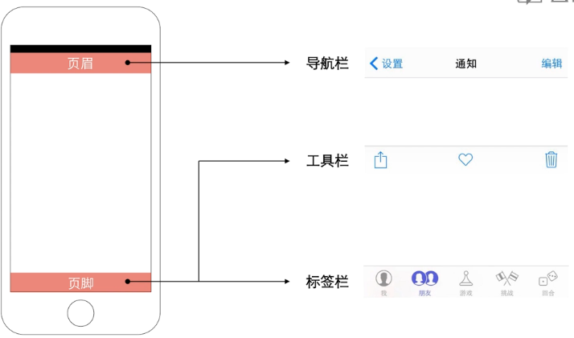

- 页眉——导航栏：用于实现在应用不同信息层级结构间的导航，有时候也可用于管理当前屏幕内容
- 页脚——工具栏：用于放置操作当前屏幕中各对象的控件
- 页脚——标签栏：标签栏让用户在不同的任务、界面和模式中进行切换

#### android平台
android平台页面布局规范，用一句话概括就是——变化与统一。

##### android 4.0
首先看一下android 4.0的页眉——操作栏（Action Bar）

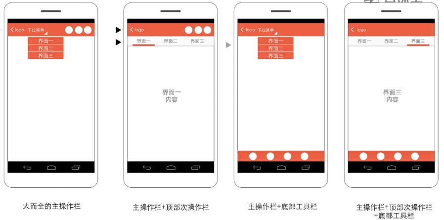

操作栏用于实现app内视图的切换和层级键的导航（返回上层），还会放置一些重要控件

##### android 5.0

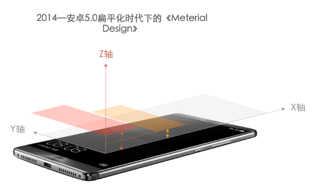

比较经典的设计模式：抽屉式导航设计模式

页眉——应用栏（APP Bar）

应用栏在以前的安卓版本中被叫做操作栏，是用来显示应用的标识，应用导航，内容搜索以及其他操作

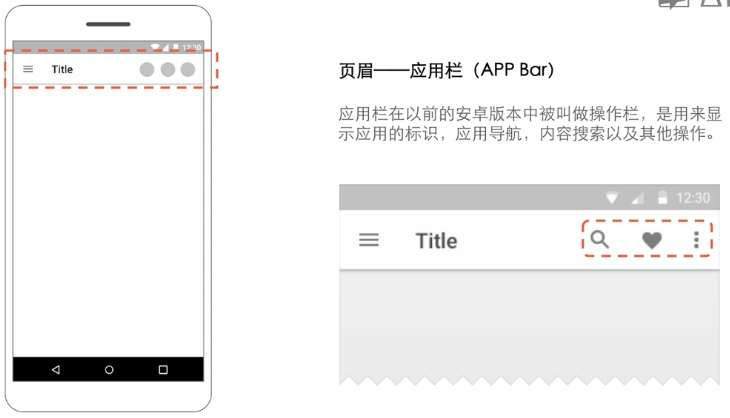

如何添加二级导航：

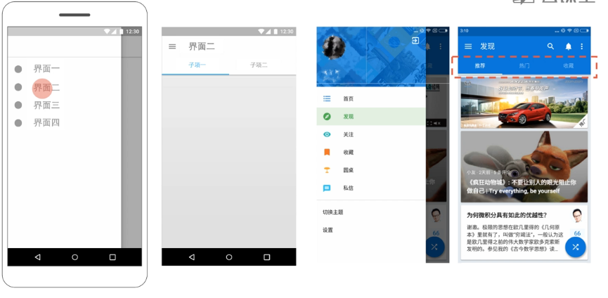

# 平台常用控件

#### 什么是控件

控制元件，用户通过控件来操作界面状态或设定状态

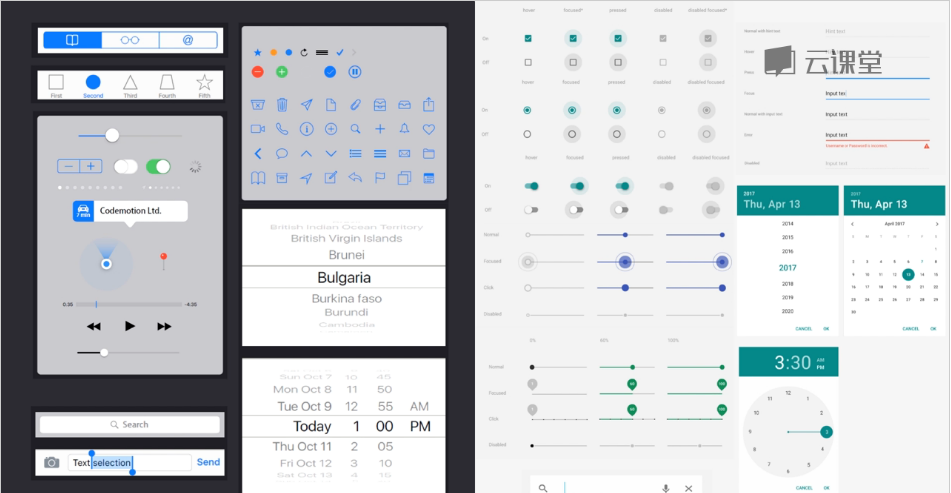

#### IOS和Android控件比较

##### 搜索
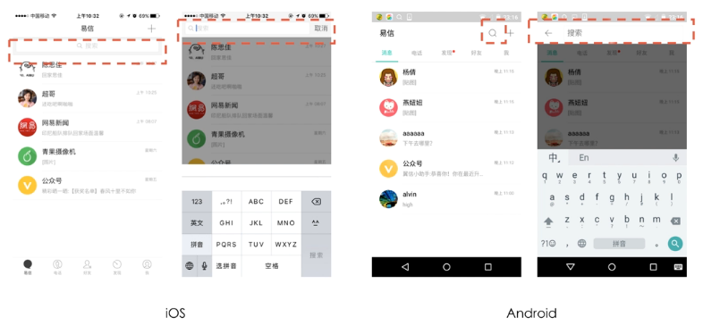

##### 时间选择器
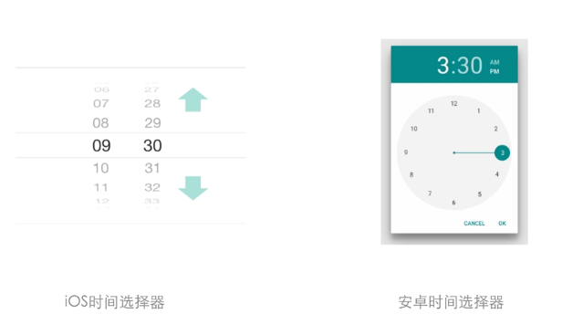

##### 滑块控件
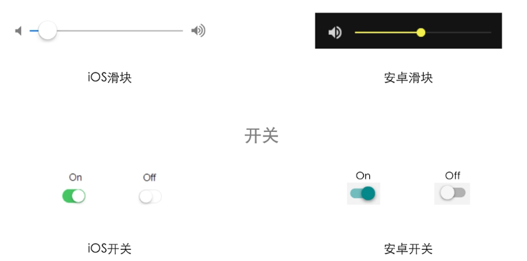

##### 进度读取
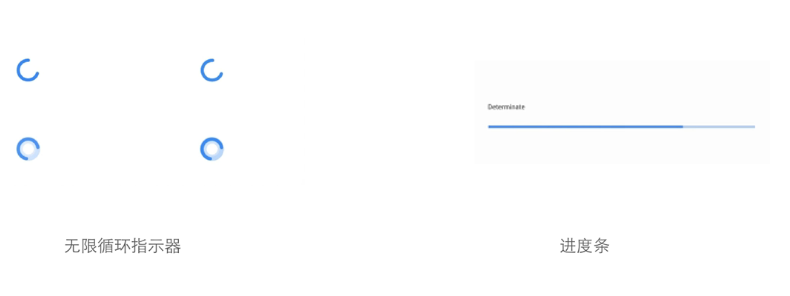

# 平台常用手势

手势操作有什么优势？
- 直觉化
- 快捷高效

常用的手势操作有哪些？
- 滑动
- 点击
- 双击
- 长按
- 拖拽
- 双指捏合
- 双指张开
- 双指旋转

ios平台和android平台对手势操作的应用有什么区别？
举例：
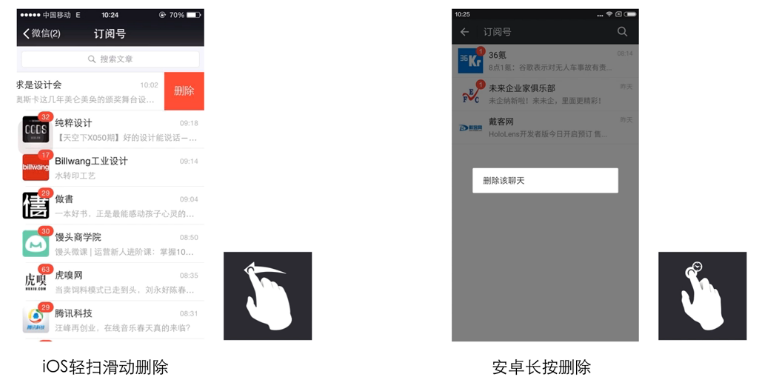
