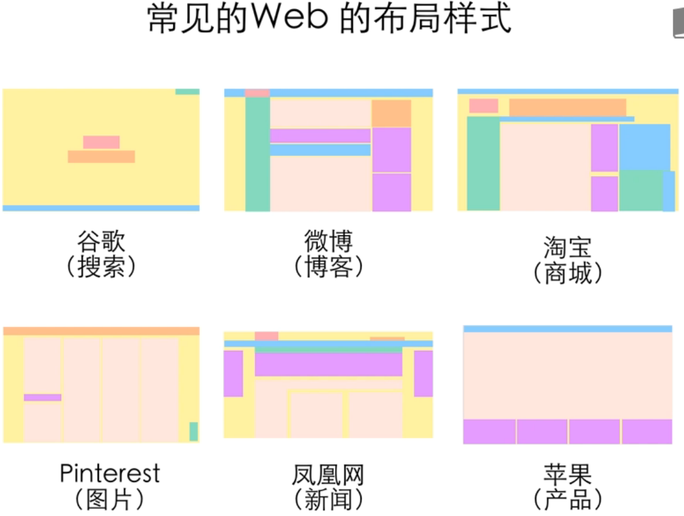
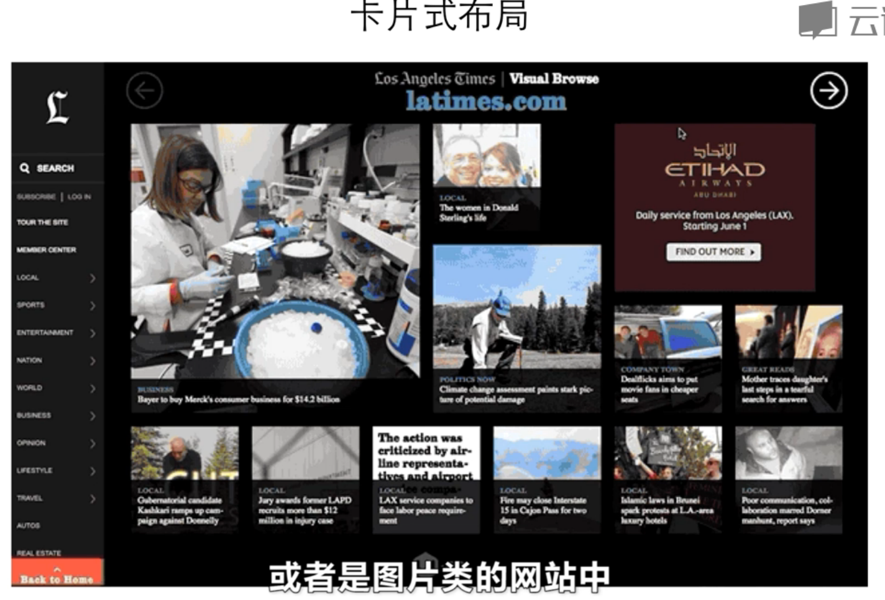
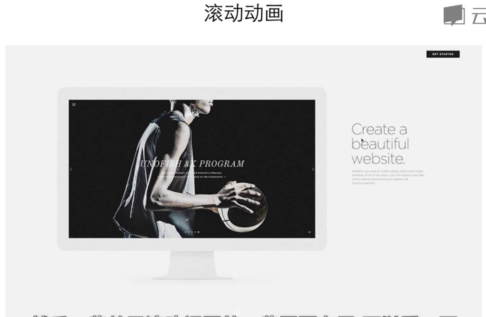
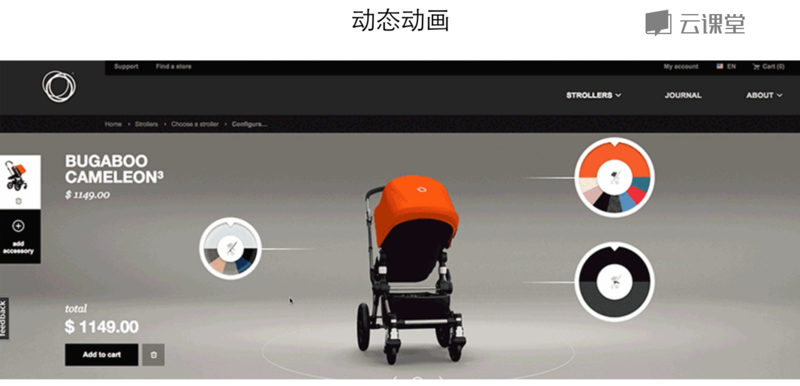

# 页面布局
常见的web布局样式

还有一些其他布局样式，例如卡片式布局、滚动动画布局、动态动画布局等。

# 页面设计
首先要明确，网站上有哪些内容要展示，
- logo
- 导航
- 用户登录或信息
- 网站推广内容
- 广告
- 其他信息

然后，对需要展示的信息进行布局，
- 布局模式选择
- 导航条固定在顶部，页面滚动时也可以看到，方便快速切换

# 自适应设计
- PC端的网页设计，在移动端小屏上显示，如果没有自适应设计，在小屏查看和操作都会很不方便
- 自适应的网页设计，就是可以自动识别屏幕宽度，并作出相应调整的网页设计
