# 垂直列表

垂直列表，顾名思义，就是从上到下垂直排列的列表：
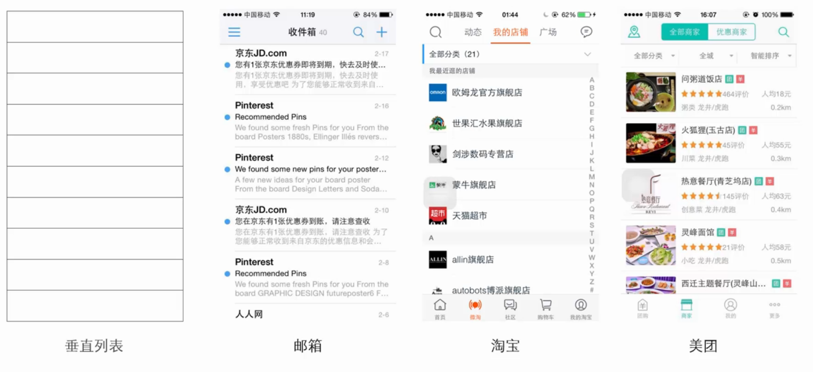

我们先来思考一个问题，用户的阅读习惯是什么？是从左往右，从上到下，所以垂直列表大都是左对齐。

垂直列表还要做到，条目详细程度和页面展示条目数量之间的平衡。

对于像外卖订单这样的场景，用户最关注的是刚刚点的订单，而对单屏显示条目数量无需求，要把条目做详细一些，这样用户可以不用点进去查看，对用户来说查看信息更快捷。

对于通讯录这样的场景，则需要显示更多的条目
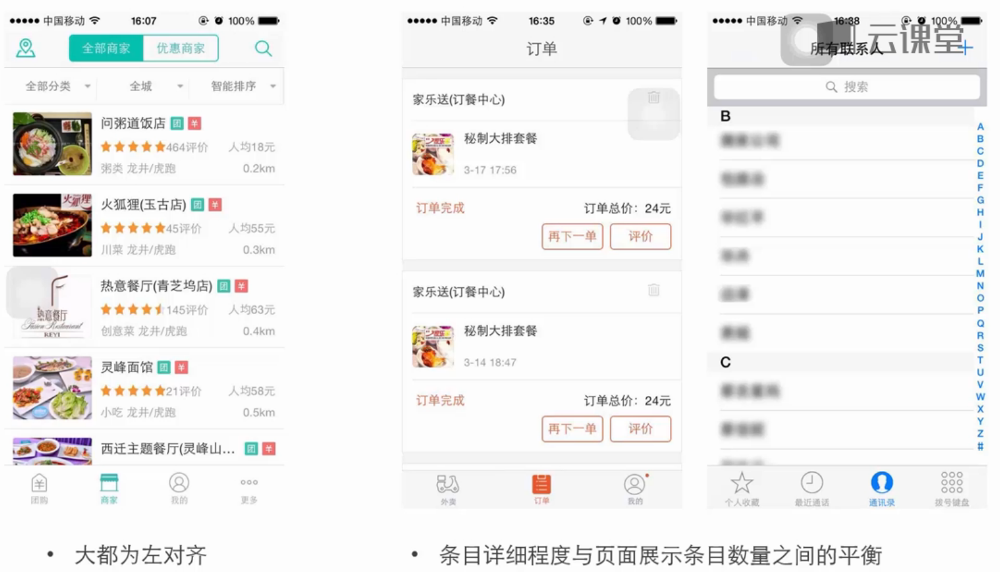

#### 垂直列表的常用样式
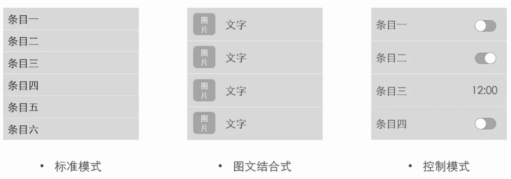

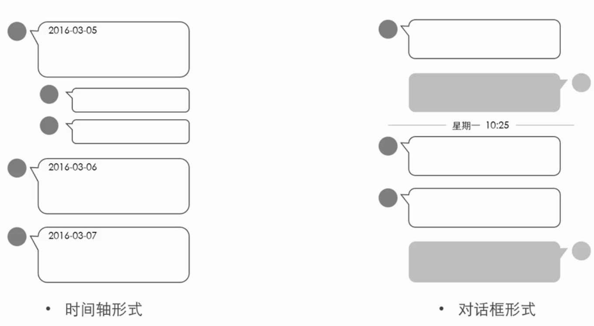

# 水平横向列表

水平横向列表，即通常说的轮播面板，它有两种展示形式，大图展示型和小图展示型。

大图展示型，通常在页面上方做为广告位：
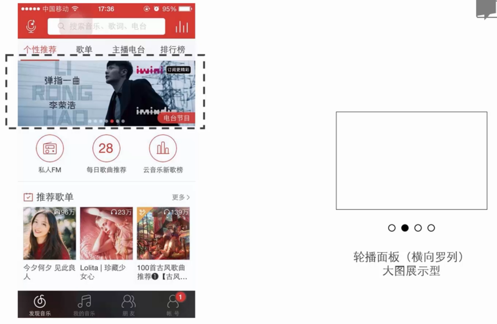

小图展示型：
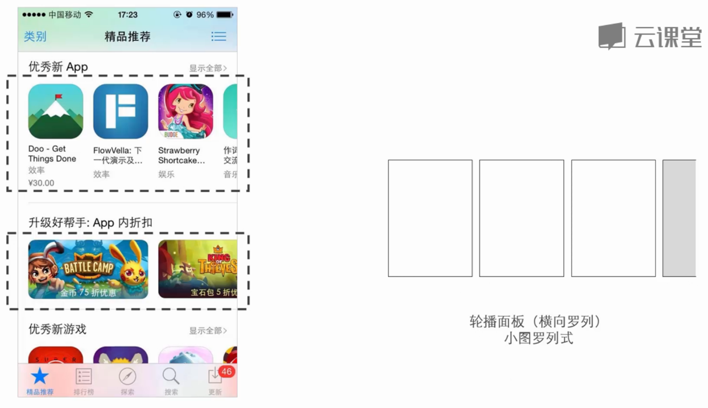

轮播面板总结：
- 需要指示器，来提示用户，表示屏幕外面还有着内容
- 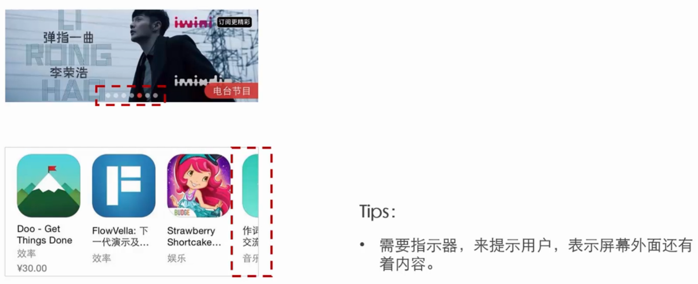

# 网格列表

与垂直列表相比，网格列表以展示图片为主
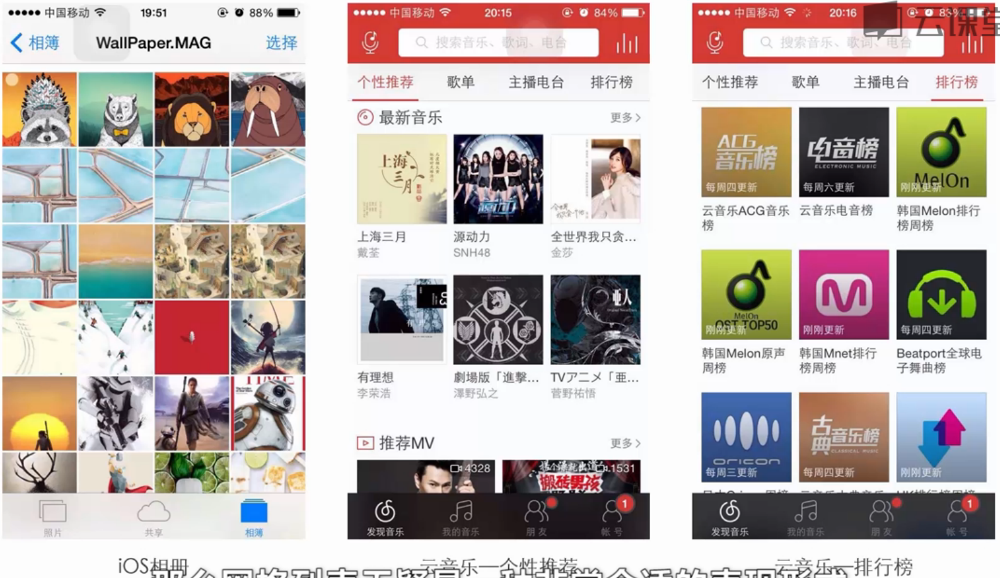

瀑布流
- 它是网格列表的变种
- 瀑布流的图片排列方式会显得非常随意
- 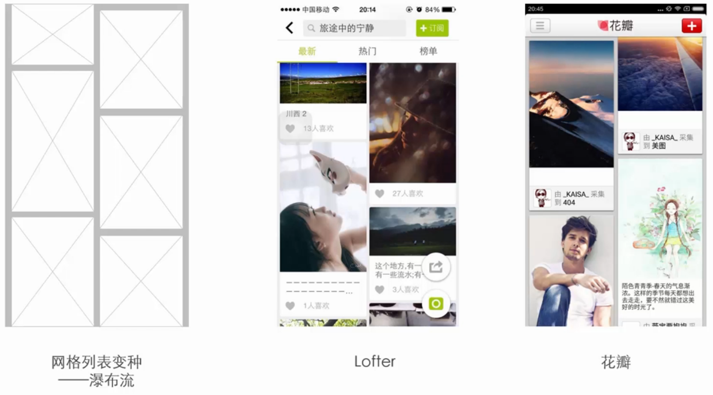

# 三种列表模式对应的导航形式
首先概括一下三种列表模式的特点：
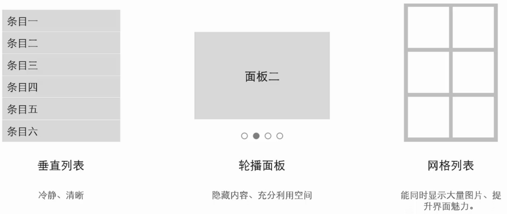

#### 垂直列表导航
特点是：简单清晰，易于理解，冷静高效，快速定位

微信的发现页面就是用的垂直列表导航，这里做的是二级导航，重要的导航条排在上面：
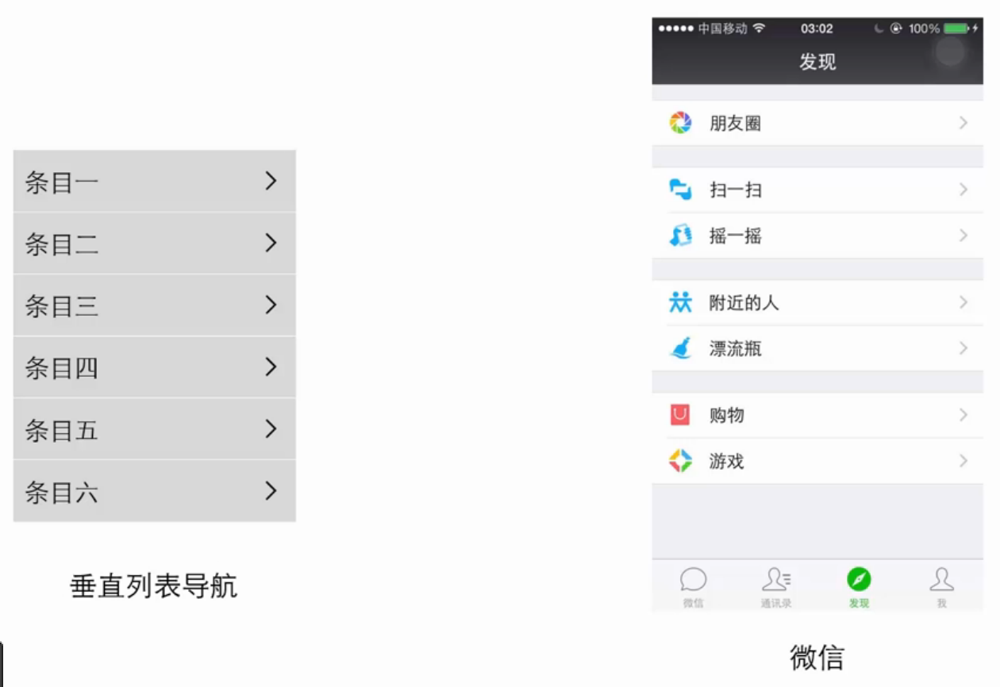

垂直列表导航也可以做一级导航，做一级导航的适用场景是：适合功能层级比较浅，且功能间切换不频繁，例如邮箱应用界面：
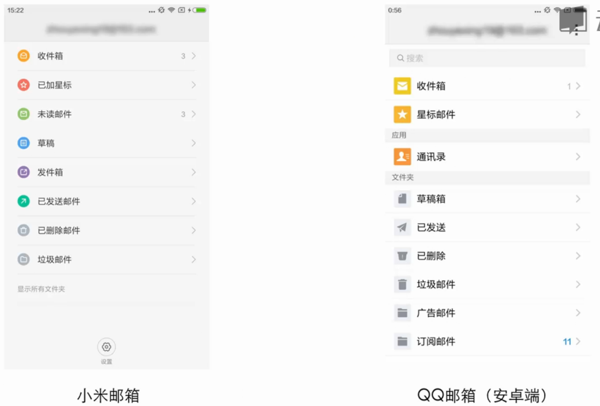

#### 轮播导航
轮播导航的特点是：隐藏其余导航选项，保证页面简洁，让用户在同一时间只专注一个目标，并且往往会配合大图或大背景，获得较好的体验感

缺点是：用户很难跳转到非相邻的导航选项

例子：
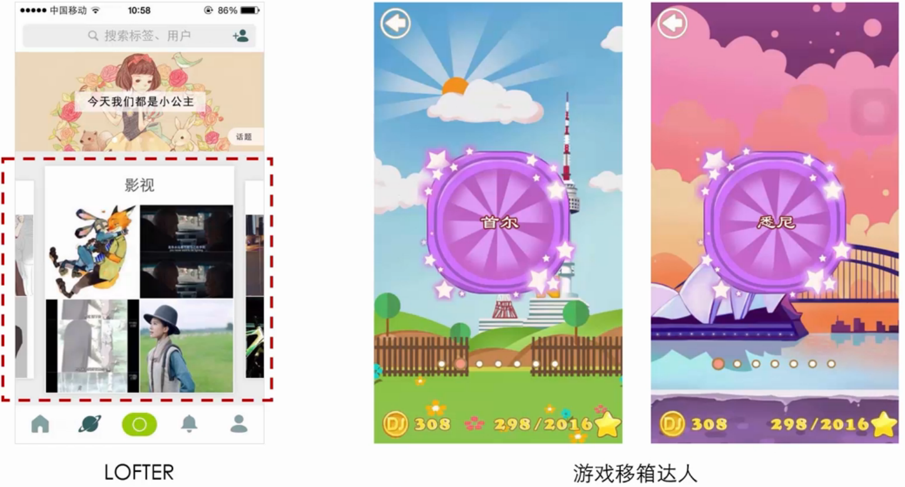

#### 网格导航（宫格导航）
网格导航很常见，例如，手机界面，所有app是以宫格形式平铺在手机界面中，网格导航让用户类似上帝视角去看整个界面情况，每个app都是平级的，功能扁平化，能充分利用整个界面，常见于二级导航。

在app内也有一些网格导航的身影：
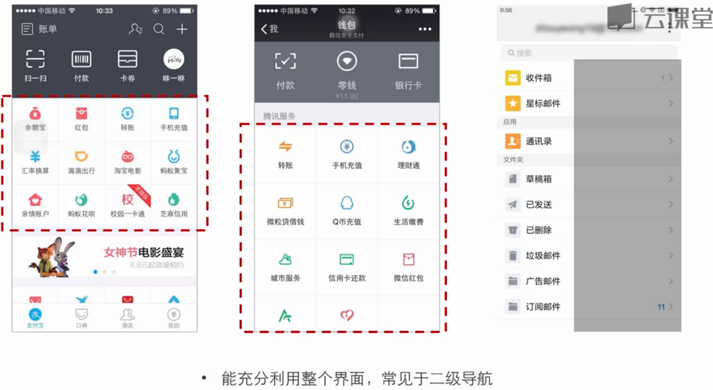

#### 总结
垂直列表：
- 简单清晰、易于理解、冷静高效、快速定位
- 适合二级导航或功能层级比较浅，且功能间切换不频繁的主导航

轮播面板
- 体验感强，适合一些功能选项较少，且不频繁跳转的产品，又或者是浏览体验式产品

网格列表
- 功能扁平化，能充分利用界面，适合作为二级导航，在有限空间内罗列大量功能

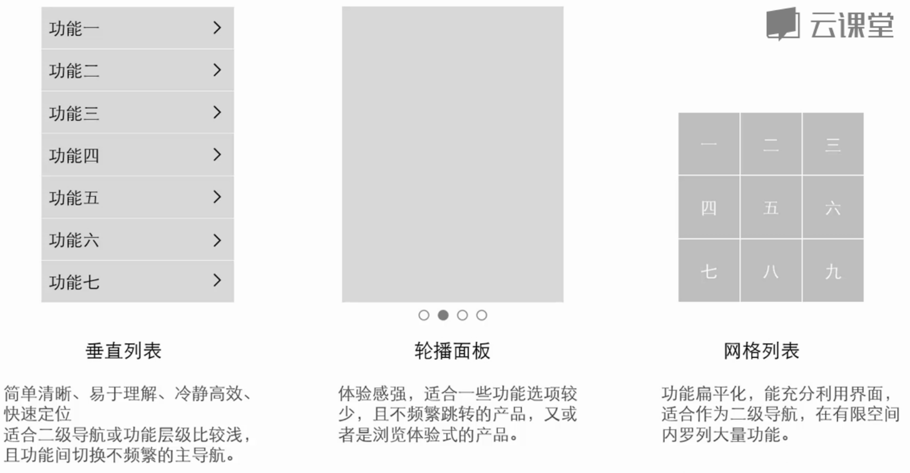
