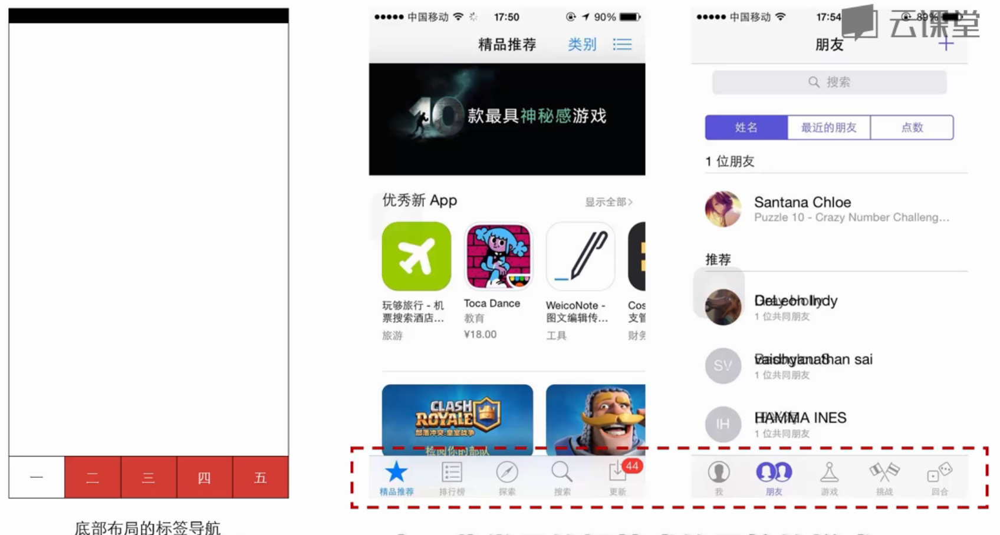
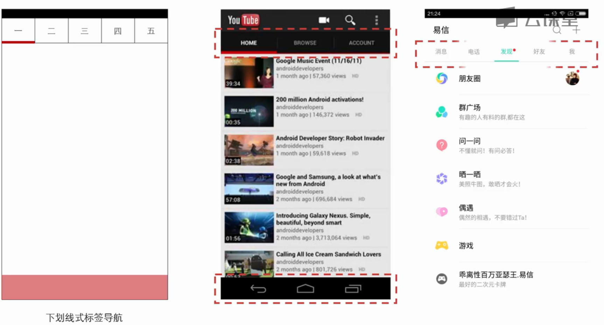
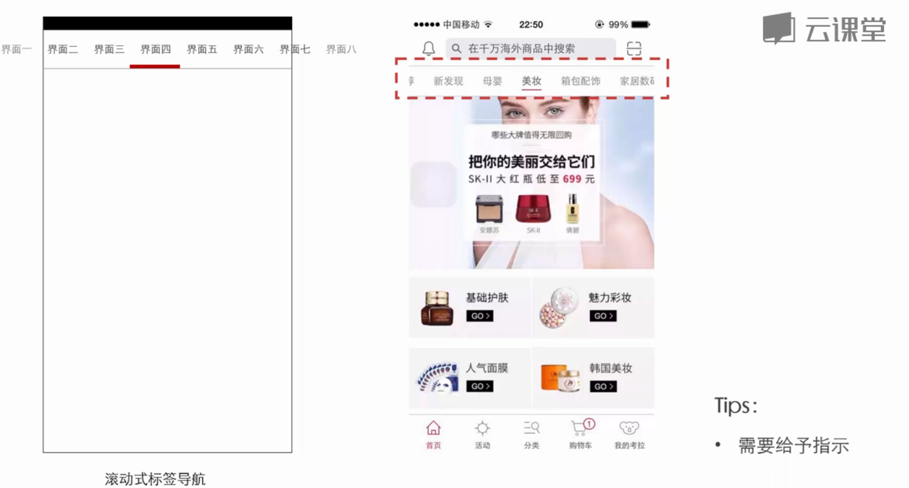
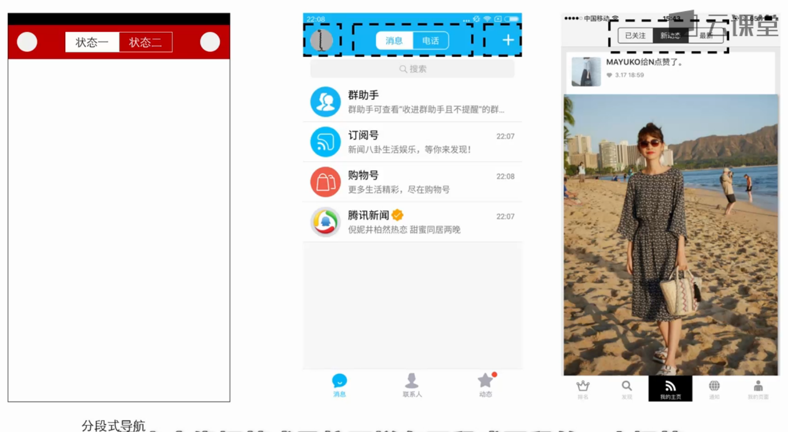
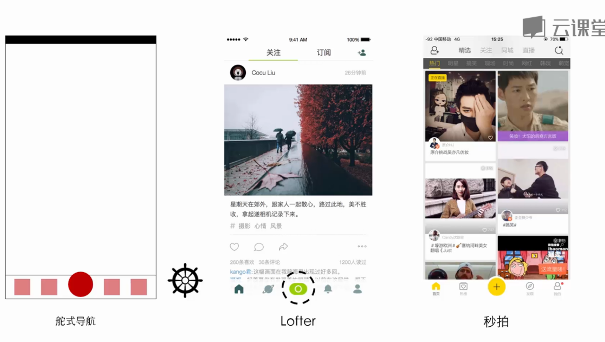
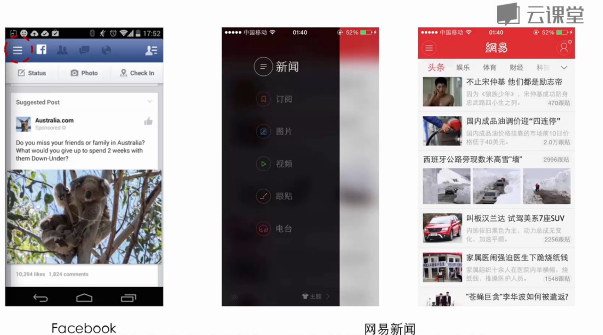
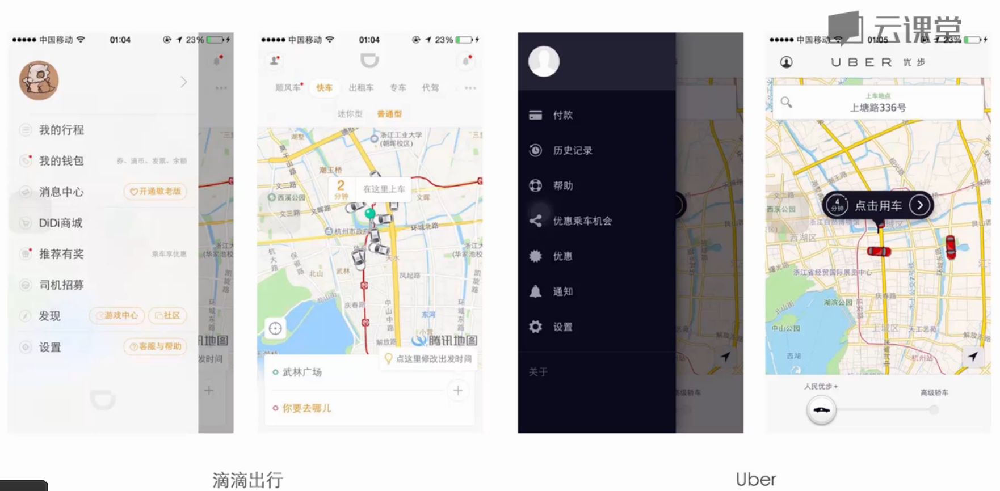
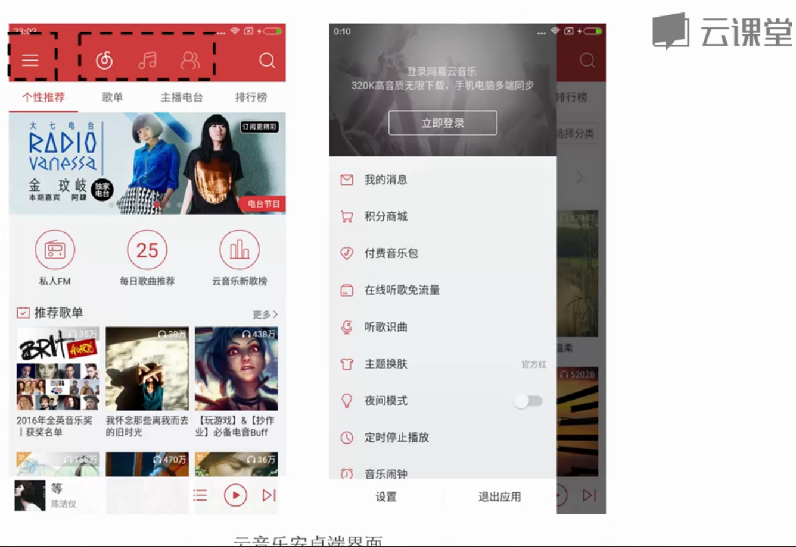
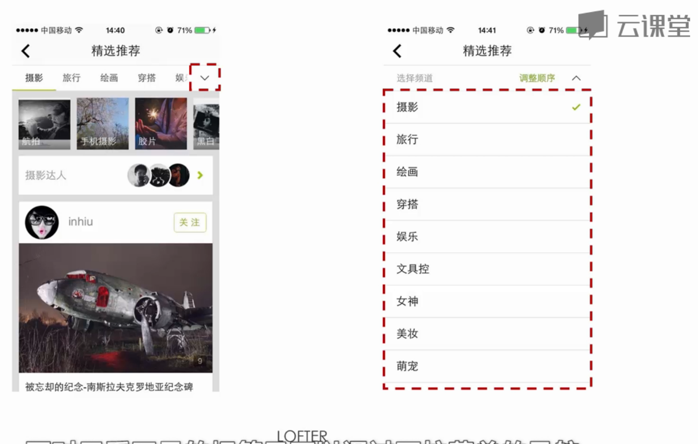
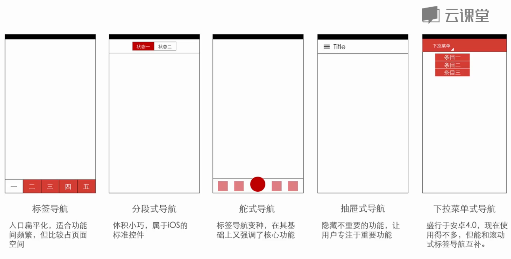

# 标签式导航

如果app有多个主要任务，而且你觉得他们都很重要，并且他们之间相互切换比较频繁，这个时候非常适用标签式的导航

标签式导航的特点：
- 入口扁平化
- 导航控件占据面积大，能够轻松进行点击操作，进行功能间快速切换

ios端一般放置在底部

Android端一般放置在顶部，一般会用下划线式标签导航

一般把标签个数控制在5个以内，可以做成滚动式标签导航，需要给予提示

# 分段式导航

分段式导航特点：
- 由分段式控件所控制的一种导航模式
- 尺寸较小，能够轻松融入界面，不占空间
- 设计师还能在其两侧放置其他UI组件

举例：

分段式导航适用场景：
- 它只是ios的标准控件
- 不适合做一级导航，往往做二级导航与标签导航嵌套使用

# 舵式导航

舵式导航适用场景：
- 在几个重要功能中，有一个功能最为重要，是app的核心功能或操作，这个时候你就可以使用舵式导航
- 这种导航模式是底部布局的标签式导航的一种变体

举例：

# 抽屉式导航

适用场景：
- 在导航的几个功能中，有一个特别重要，而其他的都不特别重要，这些功能也不能删掉，那么就需要把这些藏起来，用抽屉式导航

抽屉式导航特点：
- 隐藏不重要功能，让用户更专注核心功能
- 能够大大减少主界面中的导航控件数量

举例：

__抽屉式导航缺点：__
- 在做标签切换时，需要先点击打开抽屉，然后在点击切换标签
- 所以放在抽屉式导航中的功能一定是使用频率最低的
- 现在新版的网易新闻客户端选择标签式导航来替换抽屉式导航，基于的原因
  - 图片，视频这些功能变得很重要
  - 随着大屏的普及，用抽屉式导航所带来的浏览空间大这样的好处，变得不明显，对用户来说不重要，快速切换功能才是重要的

不过，抽屉式导航在打车软件中非常适用：

抽屉式导航和标签式导航结合的例子，网易云音乐Android客户端：

# 下拉菜单式导航

下拉菜单式导航的特点：
- 收起时：体积小，节省空间
- 展开时：能显示丰富的导航条目
- 往往没有关闭按钮

下拉菜单式导航，因为会增加点击数，一般很少用在切换频繁的场景

不过它和滚动标签导航可以结合使用，优势互补，使用在标签很多的场景

# 总结
- 没有最完美的导航，只有最合适的
- Android 5.0设计规范一段话：抽屉导航不是一个替换标签导航的通用模式，你的应用程序的结构应该指导你选择使用哪一种模式作为顶级切换导航
- 
