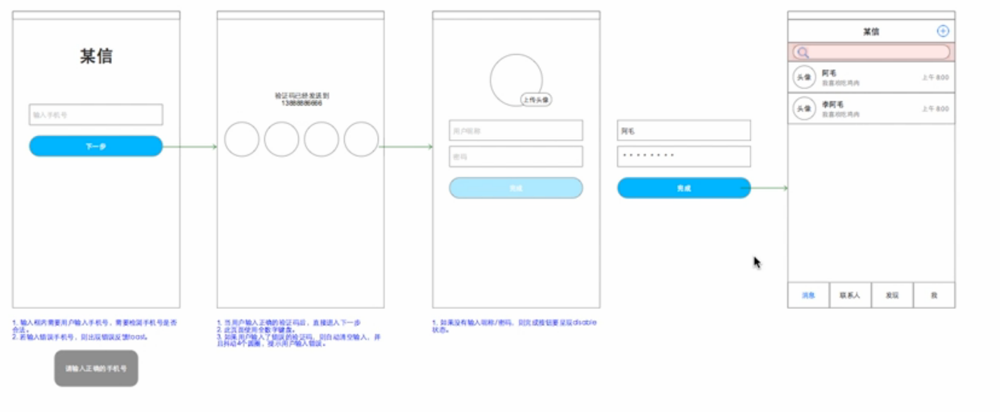

> 本节课拿设计注册流程来举例

用户进入注册页面，用户输入手机号码，点击下一步按钮，页面跳转，服务器发送验证码到手机，然后用户收到验证码并在跳转页面中输入验证码验证，页面跳转，用户填写个人资料（上传头像，用户名，密码），输入完成后，点击完成按钮，跳转到主界面，结束注册流程

在绘制的线框图下面要有详细的文字说明和样式说明，越详细越好
  - 目的是告诉开发和视觉页面相关的所有要注意的
  - 错误提示

完成交互稿制作之后，生成html文件，供开发和视觉使用
