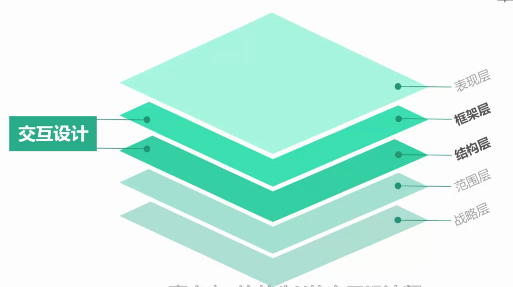

# 什么是用户体验？
国际标准化组织ISO 9241-210：用户对于使用或期望使用的产品、系统或者服务的主观感受和反应。

影响用户体验的三个因素
- 系统，就是我们产品所运行的软硬件环境
- 用户，就是使用产品的人群和对象
- 环境，用户使用产品所处在的自然环境和社会环境等

# 交互设计怎样影响着用户体验

##### 优秀的交互设计来源于生活，贴近生活的设计才是好的设计

##### 交互设计处于用户体验的哪些层面

Garrett五个用户体验层次

- 表现层
- 框架层
- 结构层
- 范围层
- 战略层

交互设计主要关注框架层和结构层

- 框架层，关注结构的布局设计
- 结构层，关注功能、信息层次的设计
