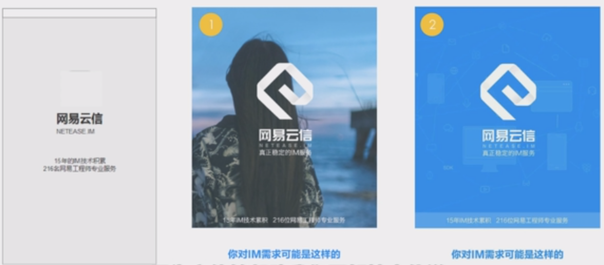

# 为什么需要懂视觉心理学？

在我们日常生活中，经常会遇到一些尴尬的场面，比如打不开的诺曼门，我们看来它是一个拉的提示，但是实际它需要推才能打开，还有生活中的也常会遇到，数据线插不进去的情况，

日常生活中充满了这种大量不美好的设计，它们往往会有一些错误的视觉引导，复杂的一些信息分类，完全不符合我们平时的一些阅读或者认知的习惯，我们在使用中各种不爽，同样在互联网中，这样的设计也是随处可见的，比如下面的登录页面，

简单介绍一下背景，这个是我们某类技术类产品的登录页面，在提供了网站的一个账号登录的同时，还提供了一个第三方登录，就是右侧的通过网易通行证登录（网易通行证在目前市面的普及率还是挺高的），但是这个登录页面有3个问题：

1. 这个登录页面，左边是网易云账号登录，右边是网易通行证登录，两种账号是平等的地位，但是通过这样的布局，我们发现似乎网易通行证是属于网易云账号的，这样的视觉页面会给我们这样的一个误导
2. 在右侧网易通行证登录上面的区域，会有一些干扰信息，因为这里我们只想提供一个快速登录的入口，但是这里额外的提供了很多繁琐的小图标，这些是对我们登录没有任何实质性的效果
3. 作为同样平等的两种账号登录，顶部的视觉效果，让我们以为网易通行证是隶属于网易云账号，还有就是右上角的关闭，这样的页面布局，会让我们以为，这个关闭是关闭掉网易通行证，而不是把整个登录体系关掉

这三个问题，也是因为我们有一些错误的视觉引导造成的，so， **运用用户观察和思考的规律来设计页面，我们才能设计出符合用户预期的产品** ，给用户极致的用户体验，而为了让这种用户体验做的更好，我们交互设计师往往会通过具体的视觉页面，来向我们用户展示一个使用场景，中间的视觉界面也就成了连接业务流程和用户体验的一个重要桥梁，通过视觉界面我们可以将不可见的这种信息架构和任务流程，转变成为一种可知的用户体验。

在看一个例子，我们在网易云阅读支付流程的优化过程中，当时我们发现，我们支付流程的流失率很高，很多人在阅读过程中需要去支付的时候，很多人都不愿去支付，主要原因是我们的支付环节过于复杂，步骤较多，所以我们的设计师在想，怎样能够优化我们的支付流程，我们把整个流程通过业务流程图的方式绘制出来，然后我们通过去除了购物车，合并了结算和充值页面，来简化整个支付流程，这些支付流程上的优化也落地成为我们用户可见的产品界面，简化了流程的页面能够让用户在整个沉浸式的阅读过程中，它不得已要去完成支付的时候，能够以一种很快捷的方式去完成，然后在回到之前的阅读体验中，整个的支付流程很流畅，所以给用户提供了一种快速愉悦的一个支付体验，而这种流畅的用户体验，最终也转变成了我们整个商业上的一个目的，就是能够有一个支付上的显著提高。所以说交互设计师 **所构建的这种用户体验和使用场景都需要我们具体的视觉界面来实现** ，最终这种视觉界面，才能同时满足产品和用户双方的需求。

交互设计师在给视觉设计师传递我们具体的设计方案的过程中，也要有对视觉界面的情感元素的要求，这样才能更好地向视觉设计师传递设计方案。

#### 总结

为什么需要懂视觉心理学？

1. 运用用户观察和思考的规律来设计界面
2. 构建的用户体验和使用场景需要通过视觉界面来实现
3. 更好地向视觉设计师传递设计方案（不仅是页面布局、页面信息的层级关系，还包括页面要传递的情感因素）

# 巧用视觉心理学来设计用户界面

> 接近性：依据间距来判断彼此间的关系，空间上的亲近暗示关系上的亲近

> 相似性：如果其他因素相同，那么相似的物体看起来归属于一组

> 相似 vs 对比：相似，表明是同类，快速做出判断；对比，表明彼此差异，适当引导。

> 封闭性：人们倾向于将缺损的轮廓加以补充使成为一个完整的封闭图形

封闭性，本质上是对完整状态的认知倾向，比如“操作的闭环”，封闭性不仅可以用到页面布局中，也可以用到流程设计中。

**常见的分组模式：点线面**

> 连续性：凡是具有连续性或者共同运动方向的物体容易被看做一个整体

> 对称性：根据视觉元素重量的不同，来营造实现视觉平衡

“不平衡”：依靠视觉重量引导用户的视觉流

> 情感化：色彩帮助营造网站的整体氛围

#### 总结：你需要懂得视觉心理学

