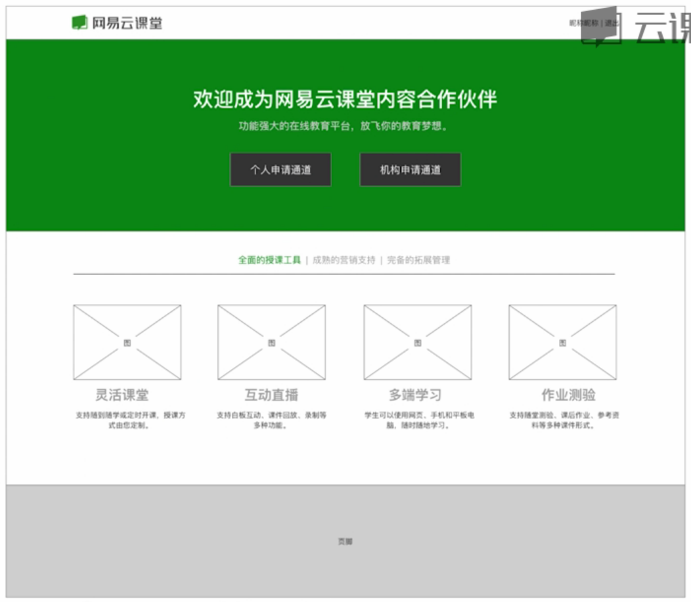
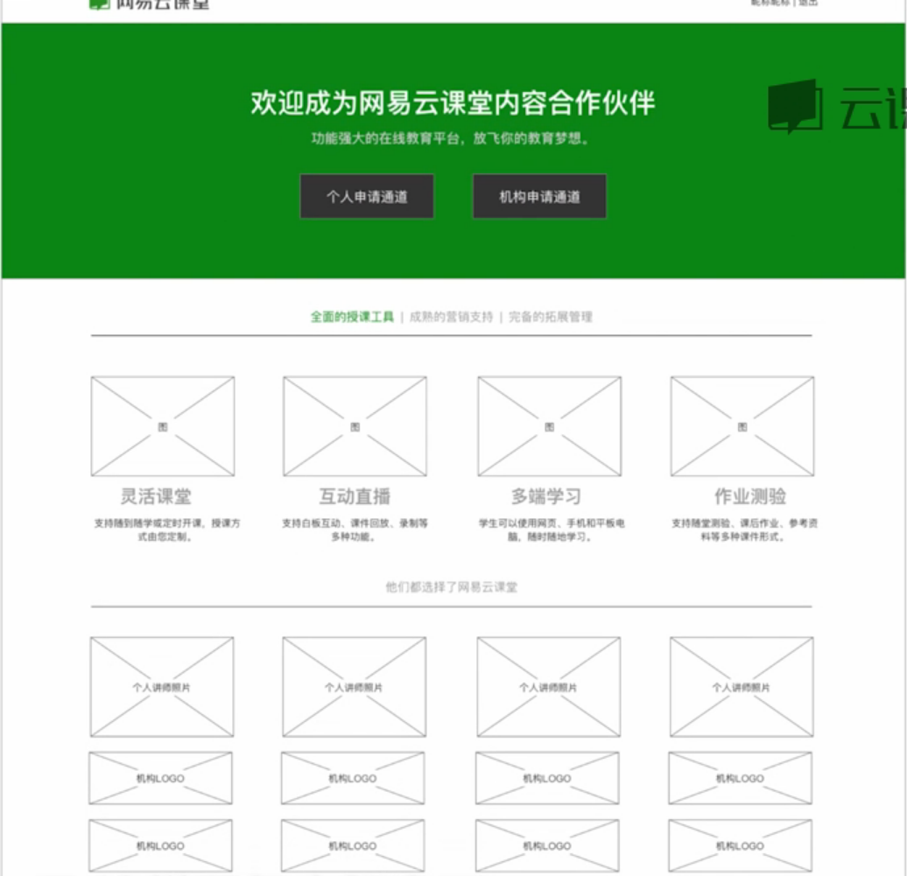
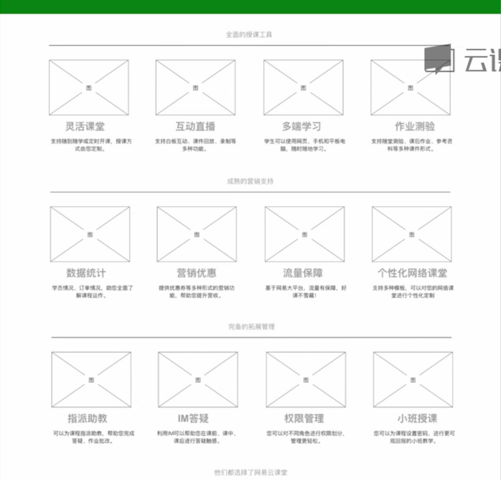
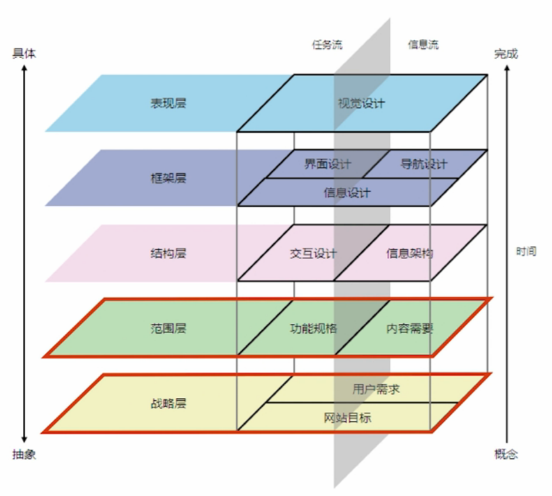

# 设计方案不能令人满意的原因

### 案例：网易云课堂，内容招募页面

两个表单：个人申请和机构申请。产品经理提了一个需求，希望为申请者提供一个好看的介绍页面，吸引更多的个人讲师或机构到云课堂开课。需求看上去很简单，直观的理解就是做一个页面。

我们大致了解到的需求是这样的：
1. 个人和机构要有独立的申请通道
2. 要有平台的特色介绍
3. 页面要做的好看一点

然后……

##### 方案1

产品经理：招商页面怎么可以没有成功案例呢？太不可思议啦。

然后……

##### 方案2

产品经理：授课工具，营销支持，拓展管理这些，还是直接展示出来更好，不要收起来。

然后……

##### 方案3

这个方案，大家看了，除了提了些文案以及样式上的意见，始终作不了决定，总觉得设计方案还是不够出彩，似乎少了一些什么东西，但是大家又说不上来。

做了三个方案都不满意，那怎么办？

在我看来，哪怕是最后一个方案也有很大提升空间，并且这个项目当中也存在一些问题，比如说：
- 设计师没有细致地沟通业务需求，一直改方案，但没有观点；
- 没有仔细分析用户需求，只是简单地进行页面排版；
- 没有对用户体验路径进行仔细分析，缺乏一个好的方式引导用户使用

所谓一个优秀的设计师，要不仅能够解决问题，应该还能够清楚地讲明白为什么是这样设计的。

##### 需求分析
> 业务需求 = 业务目的 + 业务目标

业务目的：是指我们为什么要做这块业务，当中存在哪些问题

业务目标：是指做了这块业务之后，产品期望得到怎样的成果

> 用户需求 = 目标用户（特征、经验） + 场景 + 行为 + 体验目标

比如说，谁，在什么时候，有什么样的行为，他又有什么样的目标

> 用户体验路径：搞清楚用户在使用前、使用中、使用后的各个接触点，确保设计方案能够形成闭环

永远不要用战术上的勤奋来掩饰你在战略上的懒惰。

对于交互设计师来说，最终的产出可能只是几张线框图或是流程图，但是每一个细节，每一个设计，它底下都包含设计师对于战略层的理解，比如说产品有什么样的目标，用户有什么样的需求，我的设计需要功能和内容之间如何配合等，所以说，设计师对于战略层和范围层的理解是非常关键的，因为它基本上可以决定你做的事情，到底是功劳还是苦劳，也就是最终效果到底是怎样的。

当我们在划线框图之前，通常要思考几个问题：
- 为什么要做这个功能？（业务目的）
- 产品期望得到怎么的成果？（业务目标）
- 谁来使用这个功能？（目标用户）
- 他们为什么要使用这个功能？（用户需求）
- 如何让他们都来使用这个功能？（将业务目标转化为用户行为）

交互设计工作循环过程：

1. 计划：分析业务需求和用户需求，明确设计策略

  - 分析业务需求（业务目的，业务目标）
  - 分析用户需求（目标用户，用户体验目标）
  - 分解关键因素（用户的动机、担忧、障碍）
  - 归纳设计需求，明确设计策略

2. 执行：根据设计策略，设计完整的解决方案细节
3. 检查：走查，验证并修复问题，跟踪用户反馈
4. 纠正：总结经验，修订目标，开始下一个计划
5. 从第一项再进行迭代

> 对于交互设计工作非常重要的步骤——计划，下面这张图是对它的精细阐释

##### 重要技巧

1. 将 __<u>业务目标__ 转化为 __<u>用户行为__
  - 将业务目标转化为用户行为，即通过引导用户的使用来帮助产品实现目标
2. 从设计 __<u>用户行为__ 到设计 __<u>用户界面__
  - 用户行为决定了用户界面，用户界面也导致了用户会出现什么样的行为
