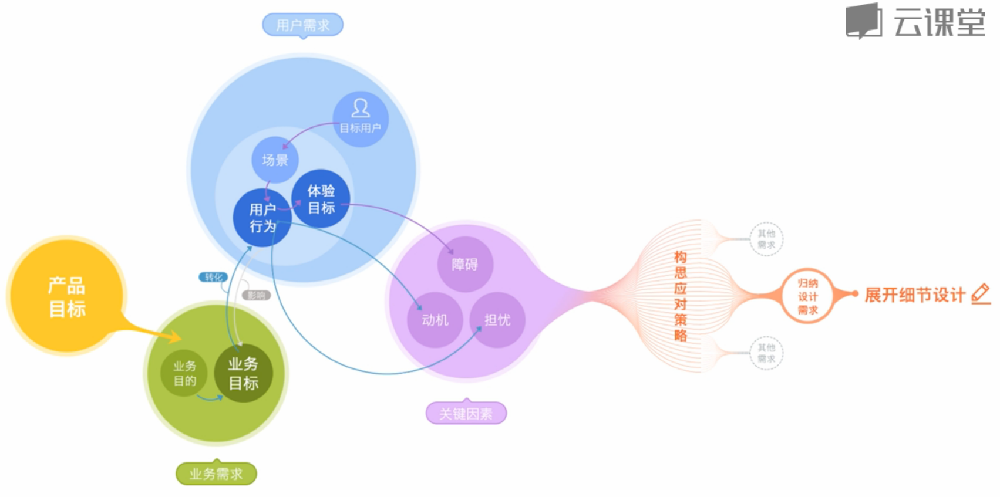
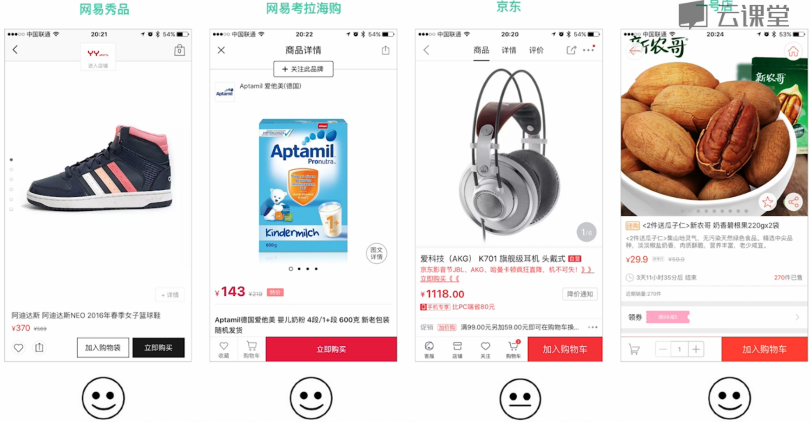
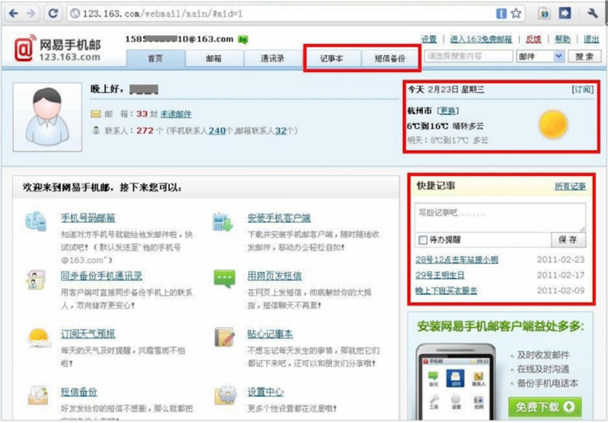

# 设计需求分析方法简介

通常来讲，一个产品在它立项的时候就会有一个明确的产品目标，这个目标描述了产品将来想要实现的最终成果，这期间可能会有多个里程碑。

比如说，在3年内打造成中国领先的在线教育平台，这就是个典型的产品目标，其实也有点产品愿景的意思，这个目标取决于产品的定位，不同的产品定位就会有不同的目标。

在产品迭代开发的过程中，相继会有N个业务需求出现，每一个业务需求，背后都隐含着某一个目的和目标，业务目的笼统来讲，就是为什么来做这个项目或者说这个功能，业务目标就是我们做了这个事情之后，我们期望得到什么样的成果。

比如说，注册：

| 业务需求 | 业务目的 | 业务目标 |
|:---:|:---:|:---:|
| 注册 | 通过登记用户信息，以方便产品进行用户管理 | 提高注册页面的转化率 |

得到业务目标之后，我们要通过设计，将业务目标转化为用户行为，也就是前面提到的，让更多用户来使用我们的产品或者功能。=====》

| 用户行为 |
|:---:|
| 点击注册按钮 |

> 如何引导用户注册

这一系列的行为和用户界面层面的设计是非常关键的步骤，因为用户的行为直接影响到我们的业务目标能不能达成，所以说，注册流程，界面元素，视觉效果等等，都会直接关系到这个结果。

在设计用户行为之前，我们当然需要先了解清楚目标用户到底是谁，所以在这一步，非常重要，我们可以通过用户研究的一些手段，了解我们的目标用户，我们可以看看他们有什么样的特征，到底是学生还是职场办公人员，同时我们还需要了解到他们的经验，也就是说他们使用同类产品或者相关设备的一些经验是怎么样的，到底是熟练的用户还是新手用户，最后也要了解到，他们通常在什么样的场景下使用我们的产品，接触我们产品的功能；用户体验目标，也就是用户期望得到的成果，我们当然也需要知道，而不是猜测用户可能想要如何如何，我们的用户产生了注册行为，通常也是基于某种原因，动机，比如说注册之后，他可以使用到更多的功能，同时在注册之前，用户也可能会有一些担忧，比如说，担心个人信息安全，用户会想，我在上面填写的这些个人信息，你们网站会不会用这些信息做一些其他事情？

所以，用户的动机，担忧，以及使用过程中遇到的障碍，都是影响达成业务目标和用户体验目标的关键因素，为了让用户和产品都能顺利达成目标，我们就需要给用户创造动机，排出担忧，解除障碍。

基于用户的动机，担忧，障碍，这些关键因素的分解，可以帮助我们得到一系列的应对策略，这就是解决方案的初步想法。

- 有哪些因素会促使用户产生注册动机？
  - 可以使用更多功能
  - 可以看到更多内容
  - 可以得到100元优惠券
  - ……
- 用户在注册前，有哪些担忧？
- 用户在注册过程中，会遇到哪些障碍

我们怎么才能确保清楚地定位到这些问题呢？显然不能100%确保，但是我们可以通过用户研究的方法，比如说像访谈，调查，去尽量清楚地定位这些问题。

构思好了相应的应对策略，基本上设计需求分析也就差不多了，我们可以把设计能够解决的策略一一进行归纳，并且和产品经理进行讨论，尽快明确下来。

然后，交互设计师就可以展开用户流程和用户界面的细节设计了。至于不能通过设计解决的应对策略，我们可以将它作为新的需求，提交给团队中其他的角色来参与协商解决。

# step1：分析业务需求
#### 第一个问题：什么是业务需求
在实际工作中，交互设计师接到的业务需求，大多数时候可能都是类似这样的，比如把购买流程优化一下，课程页面加一个分享到微信的功能，讨论区帖子要支持顶和踩，在消息中心提供清空操作，等等，仔细看这些需求，其实这里面已经包括了解决问题的手段，也就是解决方案，比如说分享到微信，支持顶和踩，提供清空操作，其实这些都是解决方案，尽管他们还没有细节的设计。

拿到需求后，我们先来思考一个问题，为什么要这么做？比如，把购买流程优化一下这个需求，为什么要这么做，现在的流程有什么问题呢？做了这些事情产品期望得到的成果是怎样的？如何来衡量我们的设计方案到底好不好？

__了解问题，比解决方案更加重要。__

> 目的和目标：简而言之，目的是达到目标之后想要做的事情，也就是实现目标的真正动机。

所以说，提供用户注册功能是一个业务需求，提高注册转化率是它的业务目标。当我们提高了注册转化率，就能获得更多的用户数，从而实现有效进行用户管理的目的。

__互联网产品常见的目标（提升/降低）__

|产品类|PV、UV、用户数、转化率、留存率、活跃度等|
|---|---|
|市场类|传播量、市场份额、各种排名等|
|品牌类|服务认知、品牌认知、品牌忠诚度等|
|营收类|销售量、销售额、利润率、ROI等|

制定目标时，不宜过多，要精确定位目标，集中力量，要符合smart原则：
- Specific 具体的
- Measurable 可衡量的
- Attainable 可实现的
- Relevant 有关联的
- Time-based 有时限的

##### 举例：

产品是想让更多的用户使用哪种方式来购买呢？如果 __立即购买__ 是产品希望更多的用户产生的行为，也就是提高购买转化率才是业务目标的话，那么立即购买按钮就应该有别于加入购物车这个按钮，我们可以通过信息的层级，视觉样式，来引导用户点击某个按钮，那当然，如果某种商品的类型，用户更多的可能是批量购买行为时，那显然，优先加入购物车这个方案也是不错的选择。

> 总结：业务需求 = 业务目标 + 业务目的

#### 第二个问题：如果没有目标会怎么样？
案例：网易手机号码邮箱：

> 实现只要知道对方手机号码，就可以给他的手机发送邮件的功能

产品经理：我们接到老大的任务，要做一个手机号码邮箱。功能特点是，只要知道对方的手机号码，就可以给他发邮件。

交互设计师：这个想法不错！但有一个问题，万一换手机号了怎么办？

产品经理：恩，这些细节我们都要考虑仔细一些。另外，用户经常登录邮箱的话，也会有查看天气的需求。xx邮箱也有，我们加上天气显示吧。

视觉设计师：那我要好好画一下各种天气的图标，这个需要花一点时间。

开发：能不能排到下一个迭代？现在做不了那么多了。

……

做的过程非常辛苦，最终的产品是这个样子的：

用户用手机号码登录，系统就会分配给他一个手机号码的邮箱，同时邮箱的功能也非常强大，天气预报、记事本、日程管理都有，但是结果并不是太好，要说这个需求其实也很简单，当发邮件的用户，想不起某个收件人的邮箱地址的时候，我们可以把他的手机号码填上去，然后就把邮件发到他手机号码邮箱里面。

如果是以获得更多的邮箱注册用户为目的的话，方便用户使用为目标的话，显然完全不需要做一款新的邮箱产品，在网易163，126邮箱中，收件人地址栏提供可直接输入手机号码来发送邮件的功能，其实会是一个更精妙的设计，那事实证明后来也的确改成了这样的方案。

##### 没有目标导致的结果
1. 方案的讨论容易发散
2. 方案的评估缺乏评判标准
3. 方案的效果无法衡量

#### 第三个问题：了解业务目的和目标后，该怎么做？
案例：网易云课堂，内容招募页面

分析业务目的和业务目标：

|业务需求|业务目的|业务目标|
|---|---|---|
|做一个内容招募页|获得更多精品课程|有更多的专业人士和机构到云课堂开课|
