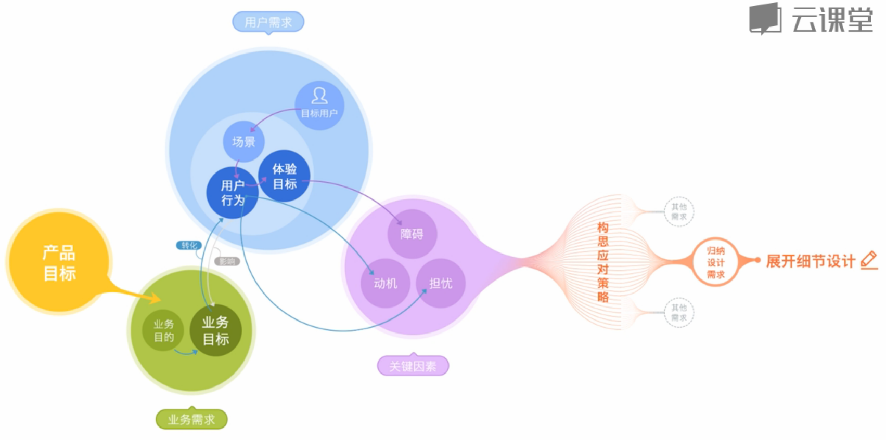
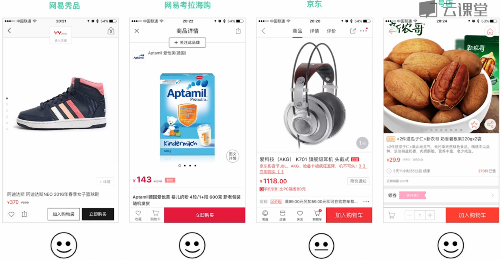
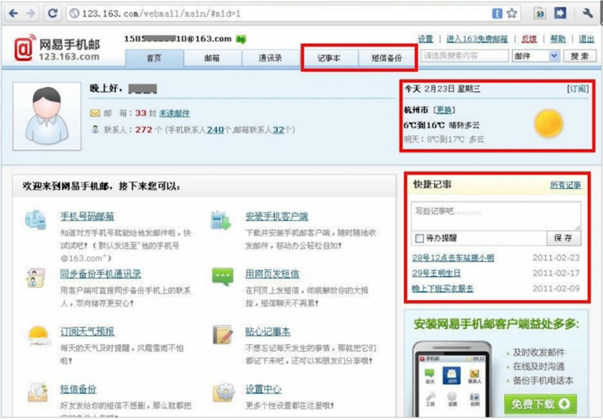
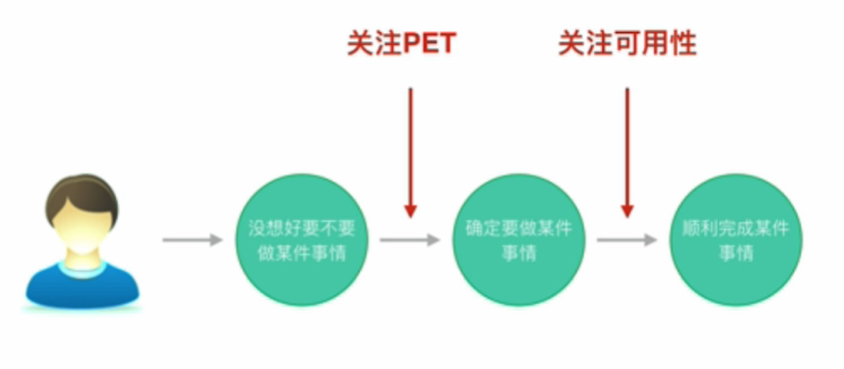

# 设计需求分析方法简介

通常来讲，一个产品在它立项的时候就会有一个明确的产品目标，这个目标描述了产品将来想要实现的最终成果，这期间可能会有多个里程碑。

比如说，在3年内打造成中国领先的在线教育平台，这就是个典型的产品目标，其实也有点产品愿景的意思，这个目标取决于产品的定位，不同的产品定位就会有不同的目标。

在产品迭代开发的过程中，相继会有N个业务需求出现，每一个业务需求，背后都隐含着某一个目的和目标，业务目的笼统来讲，就是为什么来做这个项目或者说这个功能，业务目标就是我们做了这个事情之后，我们期望得到什么样的成果。

比如说，注册：

| 业务需求 | 业务目的 | 业务目标 |
|:---:|:---:|:---:|
| 注册 | 通过登记用户信息，以方便产品进行用户管理 | 提高注册页面的转化率 |

得到业务目标之后，我们要通过设计，将业务目标转化为用户行为，也就是前面提到的，让更多用户来使用我们的产品或者功能。=====》

| 用户行为 |
|:---:|
| 点击注册按钮 |

> 如何引导用户注册

这一系列的行为和用户界面层面的设计是非常关键的步骤，因为用户的行为直接影响到我们的业务目标能不能达成，所以说，注册流程，界面元素，视觉效果等等，都会直接关系到这个结果。

在设计用户行为之前，我们当然需要先了解清楚目标用户到底是谁，所以在这一步，非常重要，我们可以通过用户研究的一些手段，了解我们的目标用户，我们可以看看他们有什么样的特征，到底是学生还是职场办公人员，同时我们还需要了解到他们的经验，也就是说他们使用同类产品或者相关设备的一些经验是怎么样的，到底是熟练的用户还是新手用户，最后也要了解到，他们通常在什么样的场景下使用我们的产品，接触我们产品的功能；用户体验目标，也就是用户期望得到的成果，我们当然也需要知道，而不是猜测用户可能想要如何如何，我们的用户产生了注册行为，通常也是基于某种原因，动机，比如说注册之后，他可以使用到更多的功能，同时在注册之前，用户也可能会有一些担忧，比如说，担心个人信息安全，用户会想，我在上面填写的这些个人信息，你们网站会不会用这些信息做一些其他事情？

所以，用户的动机，担忧，以及使用过程中遇到的障碍，都是影响达成业务目标和用户体验目标的关键因素，为了让用户和产品都能顺利达成目标，我们就需要给用户创造动机，排出担忧，解除障碍。

基于用户的动机，担忧，障碍，这些关键因素的分解，可以帮助我们得到一系列的应对策略，这就是解决方案的初步想法。

- 有哪些因素会促使用户产生注册动机？
  - 可以使用更多功能
  - 可以看到更多内容
  - 可以得到100元优惠券
  - ……
- 用户在注册前，有哪些担忧？
- 用户在注册过程中，会遇到哪些障碍

我们怎么才能确保清楚地定位到这些问题呢？显然不能100%确保，但是我们可以通过用户研究的方法，比如说像访谈，调查，去尽量清楚地定位这些问题。

构思好了相应的应对策略，基本上设计需求分析也就差不多了，我们可以把设计能够解决的策略一一进行归纳，并且和产品经理进行讨论，尽快明确下来。

然后，交互设计师就可以展开用户流程和用户界面的细节设计了。至于不能通过设计解决的应对策略，我们可以将它作为新的需求，提交给团队中其他的角色来参与协商解决。

# step1：分析业务需求
#### 第一个问题：什么是业务需求
在实际工作中，交互设计师接到的业务需求，大多数时候可能都是类似这样的，比如把购买流程优化一下，课程页面加一个分享到微信的功能，讨论区帖子要支持顶和踩，在消息中心提供清空操作，等等，仔细看这些需求，其实这里面已经包括了解决问题的手段，也就是解决方案，比如说分享到微信，支持顶和踩，提供清空操作，其实这些都是解决方案，尽管他们还没有细节的设计。

拿到需求后，我们先来思考一个问题，为什么要这么做？比如，把购买流程优化一下这个需求，为什么要这么做，现在的流程有什么问题呢？做了这些事情产品期望得到的成果是怎样的？如何来衡量我们的设计方案到底好不好？

__了解问题，比解决方案更加重要。__

> 目的和目标：简而言之，目的是达到目标之后想要做的事情，也就是实现目标的真正动机。

所以说，提供用户注册功能是一个业务需求，提高注册转化率是它的业务目标。当我们提高了注册转化率，就能获得更多的用户数，从而实现有效进行用户管理的目的。

__互联网产品常见的目标（提升/降低）__

|产品类|PV、UV、用户数、转化率、留存率、活跃度等|
|---|---|
|市场类|传播量、市场份额、各种排名等|
|品牌类|服务认知、品牌认知、品牌忠诚度等|
|营收类|销售量、销售额、利润率、ROI等|

制定目标时，不宜过多，要精确定位目标，集中力量，要符合smart原则：
- Specific 具体的
- Measurable 可衡量的
- Attainable 可实现的
- Relevant 有关联的
- Time-based 有时限的

##### 举例：

产品是想让更多的用户使用哪种方式来购买呢？如果 __立即购买__ 是产品希望更多的用户产生的行为，也就是提高购买转化率才是业务目标的话，那么立即购买按钮就应该有别于加入购物车这个按钮，我们可以通过信息的层级，视觉样式，来引导用户点击某个按钮，那当然，如果某种商品的类型，用户更多的可能是批量购买行为时，那显然，优先加入购物车这个方案也是不错的选择。

> 总结：业务需求 = 业务目标 + 业务目的

#### 第二个问题：如果没有目标会怎么样？
案例：网易手机号码邮箱：

> 实现只要知道对方手机号码，就可以给他的手机发送邮件的功能

产品经理：我们接到老大的任务，要做一个手机号码邮箱。功能特点是，只要知道对方的手机号码，就可以给他发邮件。

交互设计师：这个想法不错！但有一个问题，万一换手机号了怎么办？

产品经理：恩，这些细节我们都要考虑仔细一些。另外，用户经常登录邮箱的话，也会有查看天气的需求。xx邮箱也有，我们加上天气显示吧。

视觉设计师：那我要好好画一下各种天气的图标，这个需要花一点时间。

开发：能不能排到下一个迭代？现在做不了那么多了。

……

做的过程非常辛苦，最终的产品是这个样子的：

用户用手机号码登录，系统就会分配给他一个手机号码的邮箱，同时邮箱的功能也非常强大，天气预报、记事本、日程管理都有，但是结果并不是太好，要说这个需求其实也很简单，当发邮件的用户，想不起某个收件人的邮箱地址的时候，我们可以把他的手机号码填上去，然后就把邮件发到他手机号码邮箱里面。

如果是以获得更多的邮箱注册用户为目的的话，方便用户使用为目标的话，显然完全不需要做一款新的邮箱产品，在网易163，126邮箱中，收件人地址栏提供可直接输入手机号码来发送邮件的功能，其实会是一个更精妙的设计，那事实证明后来也的确改成了这样的方案。

##### 没有目标导致的结果
1. 方案的讨论容易发散
2. 方案的评估缺乏评判标准
3. 方案的效果无法衡量

#### 第三个问题：了解业务目的和目标后，该怎么做？
案例：网易云课堂，内容招募页面

分析业务目的和业务目标：

|业务需求|业务目的|业务目标|
|---|---|---|
|做一个内容招募页|获得更多精品课程|有更多的专业人士和机构到云课堂开课|

让目标和设计建立关联（GSM）

|目标（Goal）|信号（signal）|衡量指标（Metric）|
|---|---|---|
|有更多的专业人士和机构到云课堂开课|让用户点击申请按钮|申请按钮的点击率（提高）|

我们得到具体的衡量指标：申请按钮点击率（提高）

将业务目标转化为用户行为：业务目标（有更多的专业人士和机构到云课堂开课）→用户行为（点击申请按钮）

# step2：分析业务需求
### 明确目标用户
不同类型的用户会有不同的需求，甚至他们的需求是相互冲突的，例如新手用户需要使用向导，但是在专家用户眼里是多余的，又比如说讲师通常会需要通过发送邮件来提醒学员要做作业，但是学员偏偏不怎么使用邮箱，显然我们不能做出一款让所有人都满意的产品，但是当我们搞清楚了目标用户才有可能更有针对性的展开需求分析和方案设计，获得更好的效果。

> 目标用户是指使用某个产品或服务的典型群体。

1. 目标用户是群体，不是个体
2. 目标用户是产品或服务的直接接触对象

### 分析用户需求
用户描述的需求，是外在表象。用户体验目标（指用户在使用某一产品或服务时，期望得到的最终结果）才是内在原因、动机。

> 用户需求 = 目标用户（特征、经验） + 用户场景 + 用户行为 + 用户体验目标
如果我们要描述一个完整的用户需求，它应该包含明确的目标用户，场景，行为和体验目标。

> 好的用户体验必然是超越用户期望的体验。

### 用户需求分析案例
分析目标用户和用户体验目标：
|用户需求|目标用户（特征、经验）|用户场景|用户行为|用户体验目标|
|---|---|---|---|---|
|申请在云课堂开课|秋叶：PPT讲师，熟练使用电脑|通过电脑申请|点击申请按钮|快速完成在线表单填写|

让目标和设计建立关联（GSM）：
|目标（Goal）|信号（signal）|衡量指标（Metric）|
|---|---|---|
|快速完成在线表单填写|让用户填写申请表单|表单的填写效率（提高）|

# step3：分解关键因素
### 认识关键因素
从业务视角转变成用户视角，用户基于何种动机来开课，在申请开课前有哪些担忧？
通常来讲，影响用户意愿主要有两个关键因素：
1. 动机，用户因为什么原因来使用
2. 担忧，用户在使用之前会有哪些担忧，痛点
影响用户行为的关键因素：
1. 障碍，用户在使用过程中遇到的问题

so，动机，担忧，障碍就是设计需求分析中需要考虑的三个关键因素。

### 如何分解关键因素
1. 创造 → 动机
2. 排除 → 担忧
3. 解决 → 障碍

#### 创造动机
例如：网易理财[https://8.163.com/](https://8.163.com/)，新手用户可以专享10%的年化收益，这是利用用户贪便宜的心理来给用户创造动机，类似的还有团购，限时抢购等。
再例如：直播平台用户给主播送礼物，平台会设计出送礼物的榜单排名，这样的设计也是为了满足用户的虚荣心理，来给用户使用产品创造动机，类似的还有QQ显示iPhone在线等。

#### 排除担忧
理财平台的高年化收益虽然给用户创造了动机，但是用户也会有担忧，网站靠谱吗？是不是骗子网站？方便提现吗？强大的品牌背书，庞大的交易量，以及一些利好的理财案例都是有助于排除用户担忧的设计。

> 人性：贪婪、虚荣、懒惰、窥视、从众、傲慢……

在创造动机和排除担忧这两方面都是围绕着人性来思考设计的。

#### 解决障碍
例如：使用支付宝给银行卡转账，在输入银行卡号时，上面就会同步显示放大的并且分组的数字提示，这种设计可以方便用户填写避免输入错误数字，这是一种解决障碍的设计；像新手指引也是解决使用障碍的例子。

例如：在输入验证码的时候，图片上的字母或数字不好分辨是什么的时候，在输入验证码之后进行js验证，这样的设计也是解决障碍的设计。

新手指引也是解决使用障碍的设计。

关键因素也可以这样分类：
1. 关注用户使用前的交互设计——PET（Persuasion Emotion  Trust）说服、情感、信任
2. 关注用户使用中的交互设计——可用性

以网易云课堂内容招募为例：

使用前：
<table>
  <tr>
    <th>业务需求</th>
    <th>业务目标</th>
    <th>衡量指标</th>
    <th colspan="2">关键因素分解</th>
    <th>对应的解决方案</th>
  </tr>
  <tr>
    <td rowspan="2">做一个内容招募页</td>
    <td rowspan="2">有更多的专业人士和机构到云课堂开课</td>
    <td rowspan="2">申请按钮的点击率（提高）</td>
    <td>动机</td>
    <td>能赚到钱； 教会别人，扩大自己的专业影响力；</td>
    <td>提供成功案例；</td>
  </tr>
  <tr>
    <td>担忧</td>
    <td>申请免费吗？ 赚不到钱； 平台没有足够大的用户群体； 需要提供太多的信息； 平台没有知名度； 平台技术不稳定； 审核时间太长； 是否适合我； 平台功能不强大； 是否支持我的应用类目； 将来如何收款；</td>
    <td>告诉用户免费申请； 提供成功案例； 增加平台用户数量显示； 告诉用户只需要1分钟就能完成表单提交； 告诉用户云课堂是在线教育NO.1； 提供7x24技术支持； 告诉用户24小时内会快速审核； 说明什么样的人可以来申请； 告诉用户有牛逼的教学管理功能； 告诉用户接受不同领域的课程； 告诉用户使用“网易支付”收款安全又放心；</td>
  </tr>
</table>

使用中：
<table>
  <tr>
    <th>用户需求</th>
    <th>用户体验目标</th>
    <th>衡量指标</th>
    <th colspan="2">关键因素分解</th>
    <th>对应的解决方案</th>
  </tr>
  <tr>
    <td>申请在云课堂开课</td>
    <td>快速完成在线表单填写</td>
    <td>表单的填写效率（提高）</td>
    <td>障碍</td>
    <td>需要提供太多的信息； 网络不稳定； 没有相关的证件</td>
    <td>减少非必要的信息输入； 现在申请还送xxx； 提高网络稳定性； 支持多种证明文件；</td>
  </tr>
</table>

# step4：归纳设计需求，明确设计策略